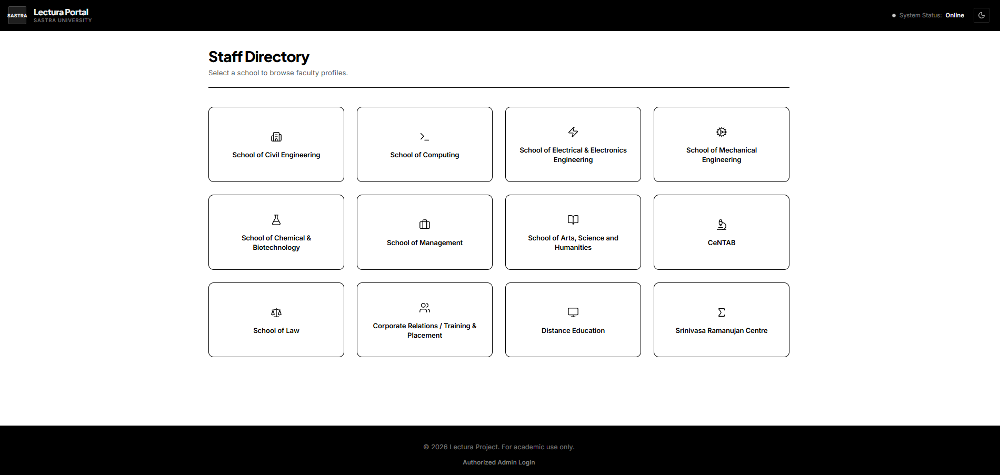
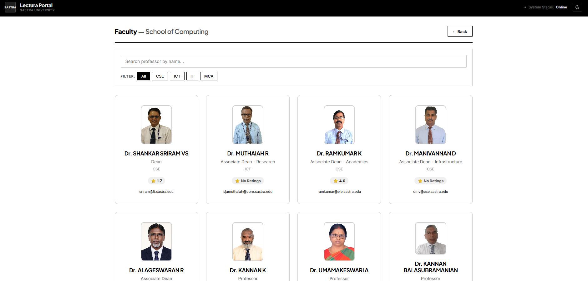
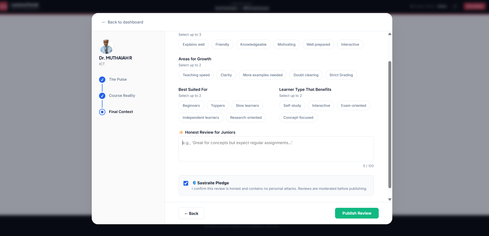

# Lectura
### Faculty Insight Platform — SASTRA University

A centralized platform for students to discover faculty, evaluate teaching quality, and make informed course decisions.

🌐 **Live Demo**  
https://lectura-faculty-review-system.vercel.app/

---

## Overview

Lectura is a **faculty review platform designed for SASTRA University students**.

It aggregates structured student feedback into faculty profiles covering:

- Teaching clarity
- Workload expectations
- Exam alignment
- Approachability
- Learning style compatibility

The platform helps students **understand professors before selecting courses.**

---

# Screenshots

## Staff Directory

Students can browse faculty across all schools.



---

## Faculty Listing

Search and filter professors with ratings.



---

## Review Submission (Admin Portal)

Authorized seniors submit structured faculty reviews.



---

# Features

## Faculty Directory

Browse faculty across **12 schools**

- Civil Engineering
- Computing
- Electrical & Electronics Engineering
- Mechanical Engineering
- Chemical & Biotechnology
- Management
- Arts & Science
- Law
- CeNTAB
- Corporate Relations
- Distance Education
- Srinivasa Ramanujan Centre

---

## Structured Faculty Profiles

Each faculty profile contains:

- Academic qualifications
- Department
- Email contact
- AI-generated review summaries
- Student feedback metrics

---

## Multi-Metric Review System

Reviews capture multiple aspects:

- Overall satisfaction
- Approachability
- Teaching clarity
- Workload
- Exam style
- Best suited learner type

---

## Secure Admin Portal

Admin login uses

- OTP verification
- JWT authentication
- Session expiration

Only authorized users can submit reviews.

---

## Tech Stack

| Layer | Technology |
|------|-------------|
| Frontend | React + Vite |
| Backend | Node.js + Express |
| Database | MongoDB Atlas |
| Auth | JWT + OTP |
| Email | Resend API |
| Scraping | Python + BeautifulSoup |
| Deployment | Vercel + Render |

---

# Architecture

Frontend (React + Vite)

↓

Backend API (Node.js + Express)

↓

MongoDB Atlas

---

# Project Structure

```
Lectura-faculty-review-system
│
├── docs/                          # README screenshots
│   ├── staff-directory.png
│   ├── faculty-list.png
│   └── review-form.png
│
├── backend/
│   ├── models/
│   │   ├── Faculty.js
│   │   ├── Review.js
│   │   ├── User.js
│   │   ├── OTPRequest.js
│   │   └── AdminSession.js
│   │
│   ├── routes/
│   │   └── auth.js
│   │
│   ├── middleware/
│   │   └── authMiddleware.js
│   │
│   ├── scripts/
│   │   └── extract_ids.py
│   │
│   ├── server.js
│   ├── seed.js
│   ├── seedData.js
│   ├── seedData.json
│   ├── merge_data.js
│   ├── updateImages.js
│   ├── scrap_all.py
│   ├── summariser.py
│   └── package.json
│
├── frontend/
│   ├── public/
│   │   └── lectura.png
│   │
│   ├── src/
│   │   ├── assets/
│   │   │   └── school-animated-buttons.css
│   │   │
│   │   ├── App.jsx
│   │   ├── App.css
│   │   ├── SchoolsGrid.jsx
│   │   ├── FacultyCard.jsx
│   │   ├── FacultyProfilePage.jsx
│   │   ├── FacultyModal.jsx
│   │   ├── FacultyForm.jsx
│   │   ├── ReviewModal.jsx
│   │   ├── AdminLogin.jsx
│   │   ├── AdminDashboard.jsx
│   │   ├── index.css
│   │   └── main.jsx
│   │
│   ├── index.html
│   ├── vite.config.js
│   ├── eslint.config.js
│   ├── package.json
│   └── .env.production
│
├── backend/.env.example
├── frontend/.env.example
│
├── README.md
└── .gitignore
```


---

# Getting Started

## Clone Repository

git clone https://github.com/your-username/Lectura-faculty-review-system.git
cd Lectura-faculty-review-system

---

## Backend Setup

cd backend
npm install

Create `.env`

PORT=5000
MONGO_URI=your_mongodb_connection_string
JWT_SECRET=your_secret
RESEND_API_KEY=your_resend_key

Run server


---

## Frontend Setup


cd frontend
npm install


Create `.env.local`


VITE_API_URL=http://localhost:5000


Run frontend
npm run dev


---

# Deployment

Frontend → **Vercel**  
Backend → **Render**

---

# License

Academic use only.
